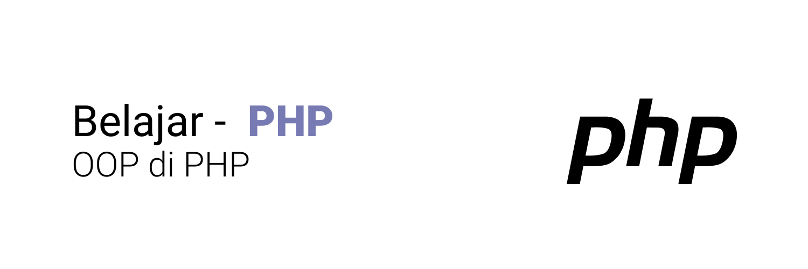

# Belajar OOP PHP
Object Oriented Programming adalah sudut pandang bahasa pemrograman yang berkonsep “objek”.
Object adalah data yang berisi field / properties / attributes dan method / function / behavior.

## class
Class adalah blueprint, prototype atau cetakan untuk membuat Object yang berisikan deklarasi semua properties dan functions yang dimiliki oleh Object.
Untuk membuat class, kita bisa menggunakan kata kunci class sedangkan untuk penamaan class biasa menggunakan format `CamelCase`. Cara menggunakan class :
```php
$hanasa = new Person();
```

### Type Declaration
Ini membuat PHP otomatis mengecek tipe data yang sesuai dengan type declaration yang telah ditentukan.
```php
class Person {
	var string $nama;
	var string $alamat;
	var string $negara;
}
```

### Default Properties Value
Sama seperti variable, di properties juga kita bisa langsung mengisi value nya, Ini mirip seperti default value, jadi jika tidak diubah di object, maka properties akan memiliki value tersebut.

```php
class Person {
	var String $nama;
	var String $alamat;
	var String $negara = "Indonesia"; // default property
}
```

### Nullable Properties
Saat kita menambah type declaration di properties atau di function argument, maka secara otomatis kita tidak bisa mengirim data null ke dalam properties atau function argument tersebut maka dari itu untuk mengisi nilai `null` kita bisa dengan cara sebelum type declaration nya, kita bisa tambahkan tanda *?*.
```php
class Person {
	var String $nama;
	var ?String $alamat; // null property menggunakan tanda ?
	var String $negara = "Indonesia";
}
```

### Function
Selain menambahkan properties, kita juga bisa menambahkan function ke object Cara dengan mendeklarasikan function tersebut di dalam block class. Untuk mengakses function tersebut, kita bisa menggunakan tanda -> dan diikuti dengan nama method nya. Sama seperti mengakses properties.
```php
class Person {
	function hello(string $nama){ // buat function
		echo "Halo $nama" .PHP_EOL;
	}

$hanasa = new Person();

$hanasa->hello("hanasa"); // panggil function

```
### This Keyword
Saat kita membuat kode di dalam function di dalam class, kita bisa menggunakan kata kunci `this` untuk mengakses object saat ini.

```php
class Person {
	var String $nama;

	function hiName(?string $nama) {
		if (is_null($nama)){
			echo "Hi, My name is $this->nama" .PHP_EOL; // this keyword
		} else{
			echo "Hi $nama, My name is $this->nama "; // this keyword
		}
	}
}
```

### Constant
Sebuah variable yang bersifat _immutable_ atau tidak bisa diubah. dulu di php bisa membuat dengan  cara method `define()`.

```php
class Person {
	const MODUL_NAME = "Belajar Php OOP"; //sengaja pakai uppercase supaya keliatan tegas.
}
echo Person::MODUL_NAME .PHP_EOL; // cara menggunakannya.
```
### self Keyword
Jika di dalam class (misal di function) kita ingin mengakses constant, kita perlu mengakses menggunakan `NamaClass::NAMA_CONSTANT`, Namun jika di dalam class yang sama, kita bisa menggunakan kata kunci `self::NAMA_CONSTANT` untuk mempermudah.

```php
class Person {
	const MODULE_NAME = "Belajar Php OOP";

	function info(){
		echo "Saya sedang belajar di modul: ". self::MODULE_NAME. PHP_EOL;
	}
}

$hanasa = new Person();
$hanasa->info();
```
### Constructor
constructor adalah function yang akan dipanggil saat pertama kali Object dibuat. Mirip seperti di function, kita bisa memberi parameter pada constructor.


### Destructor
Untuk membuat _function destructor_, kita bisa menggunakan nama _function_ `__destruct()`. Khusus untuk _destructor_, kita tidak boleh menambahkan function argument, dalam penggunaan sehari-hari, ini misal cocok untuk menutup koneksi ke database atau menutup proses menulis ke file, sehingga tidak terjadi _memory leak_.

### Inheritance
Inheritance atau pewarisan adalah kemampuan untuk menurunkan sebuah _class_ ke _class_ lain. Dalam artian, kita bisa membuat _class Parent_ dan _class Child_, _Class Child_ hanya bisa punya satu _class Parent_, namun satu _class Parent_ bisa punya banyak _class Child_, Saat sebuah _class_ diturunkan, maka semua _properties_ dan _function_ yang ada di _class Parent_ secara otomatis akan dimiliki oleh _class Child_.

```php
class UIDesigner {
	var string $name;
	var string $skill;
	function sayHalo($name){
		echo "Halo $name, nama saya $this->name, saya seorang $this->skill.". PHP_EOL;
	}
}

class FEDev extends UIDesigner { // kata kunci extends -> untuk mewarisi.

}

```

### namespace
Saat kita membuat aplikasi, bisa dipastikan kita akan banyak sekali membuat class, Jika class terlalu banyak, kadang akan menyulitkan kita untuk mencari atau mengklasifikasikan jenis-jenis class. ***Namespace bagus ketika kita punya beberapa class yang sama***, dengan menggunakan namespace nama class sama tidak akan menjadikan error di PHP.

```php
namespace Data\One {
	class Person {

	}
}

namespace Data\Two {
	class Person { // sama dengan yang diatas

	}
}


$ahan = new Data\One\Person(); // keduanya tidak akan konflik
$maya = new Data\Two\Person(); // keduanya tidak akan konflik
```
Selain **class**, kita juga menggunakan **function** dan **constant** di namespace dan jika kita ingin menggunakan function atau constant tersebut, kita bisa menggunakannya dengan diawali dengan nama namespace nya.

```php
namespace Data\One {
	const IDENTIFY = "Saya seorang Karyawan";
	class Person {

	}
}

echo Data\One\IDENTIFY; //memanggil constant
```

### Import
**use Keyword**, Sebelumnya kita sudah tahu bahwa untuk menggunakan class, function atau constant di namespace kita perlu menyebutkan nama namespace nya di awal. Jika terlalu sering menggunakan class, function atau constant yang sama, maka terlalu banyak duplikasi dengan menyebut namespace yang sama berkali-kali. Hal ini bisa kita hindari dengan cara mengimport class, function atau constant tersebut dengan menggunakan kata kunci **use**.

**Alias** adalah kemampuan membuat nama lain dari class, function atau constant yang adaKita bisa menggunakan kata kunci **as** setelah melakukan **use**.

```php
use Emp\NonCode\UIDesigner;
use function Emp\Code\ability as EmpAbility;

$UI = new UIDesigner();
EmpAbility();
```
Kadang kita butuh melakukan import banyak hal di satu namespace yang sama, PHP memiliki fitur grup use, dimana kita bisa import beberapa class, function atau constant dalam satu perintah use.
```php
require_once "data/Employers.php";
use Emp\Code\{FrontEnd as FE, BackEnd, DevOps};

$FE = new FE();
$FE->sayHello();
```
### Visiblity
Visibility / Access modifier adalah kemampuan properties, function dan constant dapat diakses dari mana saja Secara default, properties, function dan constant yang kita buat di dalam class bisa diakses dari mana saja, atau artinya dia adalah public.

| Modifier | Class | Subclass | World |
|-------|--------|------------|------|
|Public | Y | Y | Y |
|Protected | Y | Y | N |
|Private | Y | N | N |

Buka file `data/Product`

### Function Overriding
**Function overriding** adalah kemampuan mendeklarasikan ulang function di child class, yang sudah ada di parent class.

### parent Keyword
Kadang kita ingin mengakses _function_ yang terdapat di class parent yang sudah terlanjur kita override di class child, untuk mengakses function milik class parent, kita bisa menggunakan kata kunci **parent**.
Buka file `data/Profile.php`.


## Polymorphism
Polymorphism berasal dari bahasa Yunani yang berarti banyak bentuk. Dalam OOP, Polymorphism adalah kemampuan sebuah object berubah bentuk menjadi bentuk lain. Polymorphism erat hubungannya dengan Inheritance.

**Inheritance**
```php
class Programmer{
	public string $name;
	public function __construct(string $name){
		$this->name = $name;
	}
}

class BackendProgrammer extends Programmer{
}
class FrontendProgrammer extends Programmer{
}
```

**Polymorphism**
```php
class Company{
	public Programmer $programmer;
}

$company = new Company();
$company->programmer = new Programmer("Hanasa");
$company->programmer = new BackendProgrammer("Tya");
```

**Function Argument Polymorphism**
```php
function sayHelloProgrammer(Programmer $programmer){ //ngambil dari class Programmer sbg argument
	echo "Hello Programmer $programmer->name" . PHP_EOL;
}

sayHelloProgrammer(new FrontendProgrammer("Ahan"));
```

### Type Check & Casts
Khusus untuk tipe data object, kita tidak perlu melakukan konversi secara eksplisit. Namun agar aman, sebelum melakukan casts, pastikan kita melakukan type check (pengecekan tipe data), dengan menggunakan kata kunci **instanceof**. Hasil operator **instanceof** adalah _boolean_, true jika tipe data sesuai, false jika tidak sesuai.

```php
function sayHelloProgrammer(Programmer $programmer){
	if ( $programmer instanceof BackendProgrammer){ //instanceof
		echo "Hello Backend Programmer $programmer->name" . PHP_EOL;
	} elseif ( $programmer instanceof FrontendProgrammer){ //instanceof
		echo "Hello Frontend Programmer $programmer->name" . PHP_EOL;
	} else {
		echo "Hello Programmer $programmer->name" . PHP_EOL;
	}
}

```
### Abstract class
Abstract class artinya, class tersebut **tidak bisa dibuat sebagai object secara langsung**, hanya bisa diturunkan. Untuk membuat sebuah class menjadi abstract, kita bisa menggunakan kata kunci **abstract** sebelum kata kunci class.

```PHP

abstract class Location{
	public string $name;
}
class City extends Location {
}

$location = new Location(); //ERROR
$city = new City();
$city->name = "Ciamis";

```

### Abstract Function
Saat kita membuat sebuah abstract function, kita **tidak boleh** membuat block function untuk function tersebut. Artinya, abstract function **wajib** _dioverride_ di class child. Abstract function **tidak boleh** memiliki access modifier private

```php
abstract class Animal{
	public string $name;
	public function __construct(string $name){
		$this->name = $name;
	}

	abstract public function run();
}

class Cat Extends Animal{
	public function run(){
		echo "$this->name is running" .PHP_EOL;
	}
}
```

Cara _Runningnya_ sama seperti biasa.

```php
$cat = new Cat("Sunu");
$cat->run();
```
### Getter and Setter
**Encapsulation** artinya memastikan data sensitif sebuah object tersembunyi dari akses luar. Hal ini bertujuan agar kita bisa menjaga agar data sebuah object tetap baik dan valid. Untuk mencapai ini, biasanya kita akan membuat **semua properties menggunakan access modifier private**, sehingga tidak bisa diakses atau diubah dari luar Agar bisa diubah, kita akan menyediakan function untuk mengubah dan mendapatkan properties tersebut.
**Getter** adalah function yang dibuat untuk mengambil data field, **Setter** ada function untuk mengubah data field.

| Type Data | Getter Method | Setter Method |
|-----------|----------------|-------------|
|bool | `isBool(): bool` | `setBool(bool val)` |
|lainnya | `getData():typeData` | `setData(typeData val)` |


### Interface
Interface mirip seperti abstract class, yang membedakan adalah di Interface, semua method otomatis abstract, tidak memiliki block, Di interface kita tidak boleh memiliki properties, kita hanya boleh memiliki constant, Untuk mewariskan interface, k**ita menggunakan implements** dan berbeda dengan class, kita bisa implements **lebih dari satu** interface.

### Interface Inheritance
Sebelumnya kita sudah tahu kalo di PHP, child class hanya bisa punya 1 class parent, Namun berbeda dengan interface, **sebuah child class bisa implement lebih dari 1 interface**, Bahkan **interface pun bisa implement interface lain, bisa lebih dari 1.** Namun jika interface ingin mewarisi interface lain, kita menggunakan kata kunci extends, bukan implements.

```php
Interface Brand {
	function nameBrand() :string;
}
Interface isMaintenance {
	function maintenance() :bool;
}
Interface Guarante {
	function getGuarante() : string;
}

Interface Car extends Guarante {
	function drive() :void;
	function getTire() :int;
}

class Avanza implements Car, Brand, isMaintenance { // ini mempunyai Interface [Car, Brand, Guarante, isMaintenance]
	//semua function harus dipakai.
}
```

## Trait
Trait mirip dengan abstract class, kita bisa **membuat** konkrit function atau abstract function. Yang membedakan adalah, di trait bisa kita tambahkan ke dalam class lebih dari satu. Trait mirip seperti ekstension, dimana kita bisa menambahkan konkrit function ke dalam class dengan trait. Secara sederhana **trait adalah digunakan untuk** menyimpan function-function yang bisa digunakan ulang di beberapa class. Untuk menggunakan trait di class, kita bisa menggunakan kata kunci **use**.

```php
trait GoodBye
{
	public function goodBye(?string $name) :void
	{
		echo is_null($name) ? "Good Bye Manusia" .PHP_EOL : "Good Bye $name" .PHP_EOL;
	}
}

class Manusia
{
	use GoodBye; // menggunakan trait.
}

// cara menggunakan
$man = new Manusia();
$man->goodBye("Roni"); // Good Bye Rina
```

### Trait Overriding
#### Trait Abstarct Function
Jika terdapat abstract function di trait, maka secara otomatis **function tersebut harus di override** di class yang menggunakan trait tersebut.

```php
trait CanFly
{
	abstract public function fly() :void;
}
class ManusiaSuper
{
	use CanFly;
	public function fly() // override
	{
		echo "I can Fly" .PHP_EOL;
	}
}
```

#### Trait Overriding
Jika sebuah class memiliki parent class yang memiliki function yang sama dengan function di trait, maka secara otomatis trait akan meng-override function tersebut. Namun jika kita membuat function yang sama di class nya, maka secara otomatis kita akan meng-override function di trait. Sehingga posisinya seperti ini *ParentClass =override by=> Trait = override by=> ChildClass*.

```php
class Manusia
{
	use GoodBye, Hello; //trait
	public function goodBye(string $name) :void
	{
		echo "goodBye $name Manusia - override" .PHP_EOL;
	}
	public function hello(string $name) :void
	{
		echo "hello $name Manusia - override" .PHP_EOL;
	}
}

```

#### Trait Visibility Override
Selain melakukan override function di class, kita juga bisa melakukan override visibility function yang terdapat di trait.
```php
class ManusiaSuper extends Manusia
{
	use GoodBye, Hello{
		// ter-overide visiblity levelnya
		// goodBye as private;
		// hello as private;
	}
}

```

### Trait Conflict
Jika kita menggunakan lebih dari satu trait, lalu terdapat function yang sama di trait tersebut maka hal tersebut akan menyebabkan konflik. Jika terjadi konflik seperti ini, kita bisa mengatasinya dengan menggunakan kata kunci **insteadof**.

```php
// contoh trait
trait Lower {
	function A(){
		echo "a".PHP_EOL;
	}
	function B(){
		echo "b".PHP_EOL;
	}
}

trait Upper {
	function A(){
		echo "A".PHP_EOL;
	}
	function B(){
		echo "B".PHP_EOL;
	}
}

```

```php
// error
class Font {
	use Lower, Upper;
}

// benar
class Font {
	use Lower, Upper {
		Lower::A insteadof Upper; // function A() dari trait Lower
		Upper::B insteadof Lower; // funtion B() dari tarit Upper
	}
}


// sehingga
$font = new Font();
$font->A(); // a
$font->B(); // B
```

### Trait Inheritance
Trait bisa menggunakan trait lain, mirip seperti interface yang bisa implement interface lain Untuk menggunakan trait lain dari trait, penggunaannya sama seperti dengan penggunaan trait di class.
```php
trait All
{
	use GoodBye, Hello, HasName, CanFly;
}

class ManusiaSuper extends Manusia
{
	use All;
}
```

### Final Class
Kata kunci _final_ bisa digunakan di class, dimana jika kita menggunakan kata kunci _final_ sebelum class, maka kita menandakan bahwa class tersebut **tidak bisa diwariskan lagi** dan secara otomatis semua class child nya akan error.
```php
class SocialMedia
{
	var string $name;
}

final class Facebook extends SocialMedia // tidak bisa diwariskan lagi ke turunannya.
{

}

class FakeFacebook extends Facebook // tidak bisa diwariskan dari Facebook.
{

}
```

### Final Function
Kata kunci final juga bisa digunakan di function, jika sebuah function kita tambahkan kata kunci final, maka artinya function tersebut tidak bisa di override lagi di class child nya.
```php
class Facebook extends SocialMedia
{
	final function login() :string { // karena ini sudah final
		return "Welcome to FB";
	}
}

class FakeFacebook extends Facebook
{
	function login() :string {
		return "Welcome to FFB"; // error
	}
}
```

### Anonymous Class
Anonymous class atau class tanpa nama adalah kemampuan mendeklarasikan class, sekaligus meng-instansiasi object-nya secara langsung.

```php
$hello = new class("Hanasa") {
	var string $name ;

	function __construct($name){
		$this->name = $name;
	}
	function sayHello(){
		echo "hello $this->name" .PHP_EOL;
	}
}; // jangan lupa titik koma (;)
$hello->sayHello();

```

### static Keyword
Kata kunci static adalah keyword yang bisa kita gunakan untuk membuat properties atau function di class bisa diakses secara langsung tanpa menginstansiasi class terlebih dahulu. kita bisa menggunakan operator **::** untuk mengakesnya.

```php
class MathHelper
{
	static public string $name;
	static public function sum(int ...$numbers) :int
	{
		$total = 0;
		foreach ($numbers as $n)
		{
			$total += $n;
		}
		return $total;
	}
}

$sum = MathHelper::sum(12,3,3);
echo "$sum" .PHP_EOL;
```
